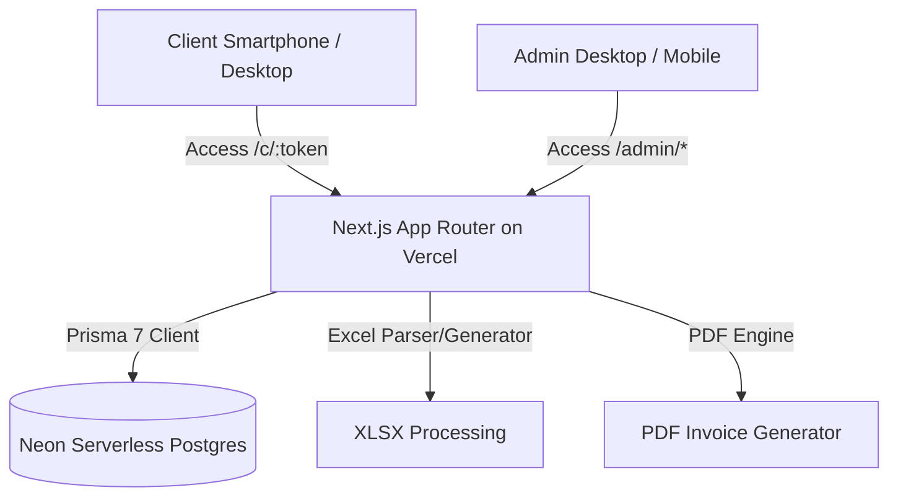
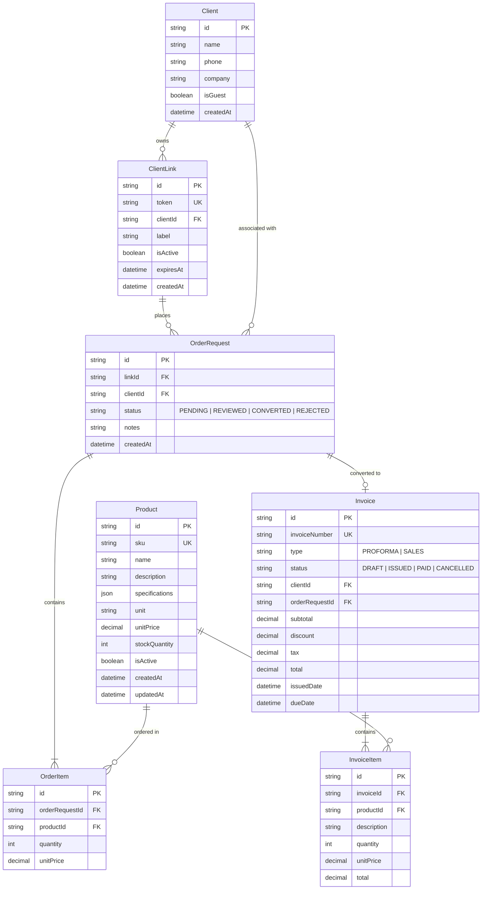

# Anbar Architecture & Technical Design

## 1. System Architecture Overview

Anbar is architected as a modern, unified Next.js application designed for zero-maintenance deployment on **Vercel** backed by a **Neon Serverless PostgreSQL** database.

---

## 2. Technology Stack

| Layer | Technology | Rationale |
| :--- | :--- | :--- |
| **Framework** | Next.js (App Router, React 19 / TypeScript) | Native Vercel deployment, SSR + Server Actions, API routes |
| **Hosting** | Vercel | Seamless CI/CD, global edge distribution, zero ops |
| **Database** | Neon (Serverless PostgreSQL) | Branching, scale-to-zero, fast serverless connection pool |
| **ORM** | Prisma 7 | Type-safe queries, migration system, strict Prisma 7 config |
| **Styling** | Tailwind CSS + Vanilla CSS Tokens | Flexible design system, responsive utility classes |
| **Component Architecture** | Radix UI primitives + Lucide Icons | Accessible, high-polish UI controls and mobile touch targets |
| **Typography** | Vazirmatn (Google Font) | Standard, highly legible Persian typeface |
| **Document Processing** | `xlsx` / `exceljs` & `@react-pdf/renderer` (or Puppeteer/HTML-to-PDF) | Excel import/export and crisp printable PDF invoices |

---

## 3. Data Model Draft

---

## 4. Key Application Routes

- `/` : Landing / Redirection page
- `/admin` : Admin Dashboard (Quick stats, recent requests, low stock alert)
- `/admin/products` : Inventory table, CRUD, Excel import/export dialog
- `/admin/links` : Dedicated client link generator and manager
- `/admin/requests` : Review incoming orders submitted by clients
- `/admin/invoices` : Proforma & Sales invoices, PDF generation and status tracking
- `/c/[token]` : **Mobile-First Client Portal** (Exclusive catalog, quantity selector, frictionless submit)
- `/c/[token]/success` : Order submitted confirmation with summary

---

## 5. UI / UX Principles for Mobile & Persian (RTL)

1. **Mobile-First Interactions:**
   - Sticky bottom action bar for the catalog view showing selected item count and a "Review & Submit" button.
   - Large, thumb-friendly numeric steppers (`+` / `-`) for quantity adjustments.
   - Expandable product specification cards to avoid visual clutter on small screens.
2. **BiDi & RTL Safeguards:**
   - Directionality set to RTL (`dir="rtl"`).
   - Strict LTR wrappers or `\u200E` for phone numbers, SKUs, calculations, currency figures (`+`, `-`, `%`).
3. **Aesthetic Excellence:**
   - Deep contrast, refined glass/surface tokens, smooth Framer Motion transitions.
   - Status indicators (e.g., Pending, In Review, Issued) with distinct, elegant badges.
