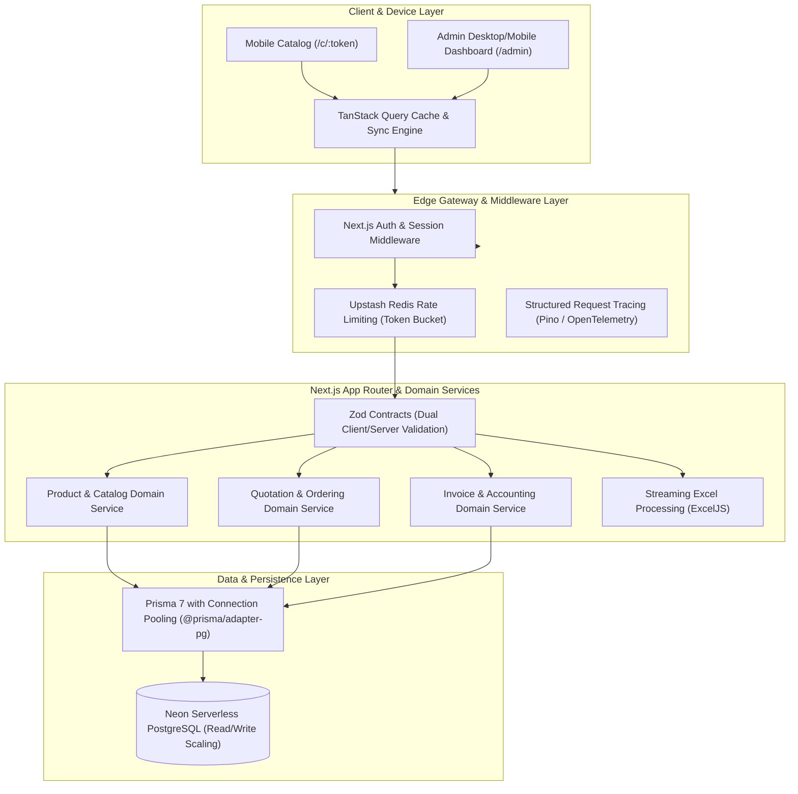
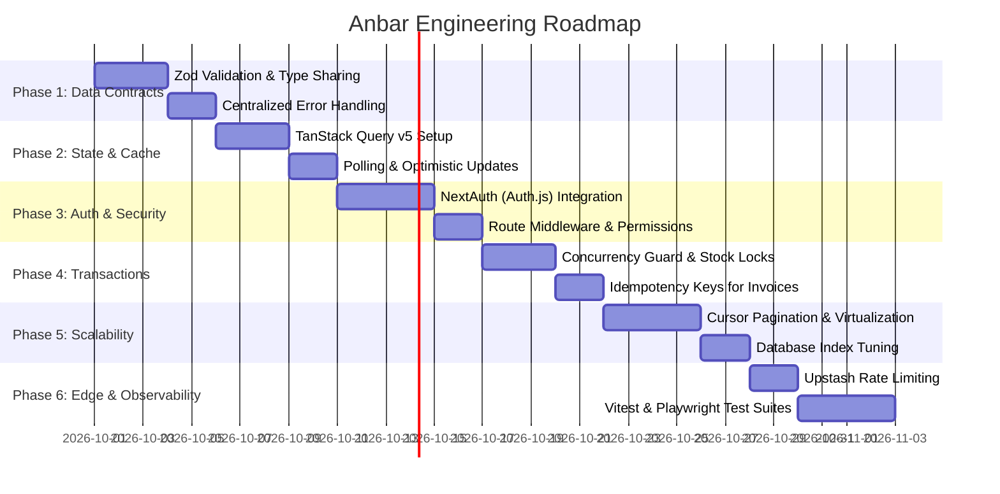

# Anbar Comprehensive Engineering & Architecture Plan

This document outlines the end-to-end technical strategy, architecture evolution, and best programming practices to transform **Anbar** into an enterprise-grade, high-performance warehouse and B2B quotation platform.

---

## 1. System Vision & Architecture Target



---

## 2. Phase-by-Phase Engineering Roadmap



---

### Phase 1: End-to-End Type Safety & Data Validation (Zod)

#### Objective
Eliminate runtime payload errors, malformed request crashes, and client-server type drift by introducing shared Zod contracts.

#### Architecture & Implementation
1. **Shared Contract Directory (`src/lib/validations/`)**:
   - `product.schema.ts`: Validates SKU uniqueness, non-negative prices, integer quantities, and valid specification JSON.
   - `order.schema.ts`: Validates item lists, quantities, customer phone format, and note character limits.
   - `link.schema.ts`: Validates URL slug formatting, expiration dates, and customer assignments.
   - `settings.schema.ts`: Validates VAT percentages, contact numbers, and invoice terms.

2. **Unified API Gateway Handler**:
   - Implement a typed wrapper `withValidation(schema, handler)` that returns standardized RFC 7807 problem details upon validation failure:
   ```json
   {
     "status": 422,
     "code": "VALIDATION_ERROR",
     "message": "اطلاعات ارسالی معتبر نمی‌باشد",
     "errors": [
       { "field": "unitPrice", "message": "قیمت نمی‌تواند منفی باشد" },
       { "field": "sku", "message": "کد کالا الزامی است" }
     ]
   }
   ```

3. **Client Form Integration**:
   - Bind `react-hook-form` with `@hookform/resolvers/zod` in modals to prevent invalid network roundtrips.

---

### Phase 2: Client State Management & Cache Synchronization (TanStack Query v5)

#### Objective
Replace ad-hoc `useEffect` fetchers with an industrial caching layer supporting automatic background revalidation, query deduplication, and optimistic mutations.

#### Architecture & Implementation
1. **Query Keys Factory (`src/lib/query-keys.ts`)**:
   - Establish strict, type-safe query key hierarchies:
     ```ts
     export const queryKeys = {
       products: {
         all: ['products'] as const,
         list: (filters: ProductFilters) => ['products', 'list', filters] as const,
         detail: (id: string) => ['products', 'detail', id] as const,
       },
       orders: {
         all: ['orders'] as const,
         pending: () => ['orders', 'pending'] as const,
       },
       links: {
         all: ['links'] as const,
       },
     };
     ```

2. **Background Polling & Liveness for Warehouse Quotes**:
   - Configure `refetchInterval: 20000` (20 seconds) for incoming quotation requests so that the warehouse administrator immediately detects new requests submitted by clients.

3. **Optimistic Mutations**:
   - When an order is confirmed, optimistically deduct inventory locally and update the badge counters while the `$transaction` executes on the server. If the server errors, automatically rollback using TanStack Query context snapshots.

---

### Phase 3: Authentication & Role-Based Access Control

#### Objective
Secure the warehouse management panel and sensitive pricing settings while keeping client catalog links frictionless and login-free.

#### Architecture & Implementation
1. **Auth Engine**:
   - Deploy **NextAuth.js (Auth.js v5)** using credentials and database adapter options.
   - Store hashed credentials via `bcrypt` / `argon2` in the `User` Prisma model.

2. **Middleware Guard (`src/middleware.ts`)**:
   - Pinned at the edge to inspect incoming requests:
     - `/admin/:path*` $\rightarrow$ Requires active session; redirects unauthenticated visitors to `/login`.
     - `/api/admin/:path*` $\rightarrow$ Returns 401 Unauthorized for unauthenticated calls.
     - `/c/:token` $\rightarrow$ Completely public and bypasses authentication for seamless customer access.

3. **Role Matrix**:
   - `ADMIN`: Full permissions (inventory mutations, price changes, invoice generation, system settings, backup download).
   - `STAFF`: Warehouse fulfillment (stock checks, physical quantity adjustments, order verification).

---

### Phase 4: Concurrency, Inventory Race Conditions & Atomic Transactions

#### Objective
Prevent inventory overselling and double-invoicing when multiple operators or concurrent customers interact with the platform.

#### Architecture & Implementation
1. **Guarded Conditional Decrement (Atomic SQL Updates)**:
   - Prevent race conditions using database-level constraints instead of reading then writing:
     ```ts
     // Within Prisma $transaction
     const result = await tx.product.updateMany({
       where: {
         id: item.productId,
         stockQuantity: { gte: item.quantity }, // Guarantees no negative stock
       },
       data: {
         stockQuantity: { decrement: item.quantity },
       },
     });
     if (result.count === 0) {
       throw new InsufficientStockError(item.productName);
     }
     ```

2. **Idempotency Keys for Invoicing**:
   - Require or generate an `Idempotency-Key` header on `/api/requests/:id/convert`. If an admin double-clicks the confirmation button, only one invoice is issued and stock is decremented exactly once.

---

### Phase 5: Scalability, Virtualization & Database Performance

#### Objective
Guarantee snappy sub-100ms response times and smooth 60fps scrolling on low-end mobile devices as the warehouse catalog grows past 10,000 SKUs.

#### Architecture & Implementation
1. **Cursor-Based API Pagination**:
   - Transform `/api/products` to accept `cursor`, `limit` (default 40), `search`, and `category`.
   - Index the PostgreSQL table with compound indexes:
     ```prisma
     @@index([isActive, category])
     @@index([isActive, createdAt(sort: Desc)])
     ```

2. **DOM Virtualization on Mobile**:
   - Implement [**@tanstack/react-virtual**](https://tanstack.com/virtual) for the mobile client catalog ([`page.tsx`](file:///d:/Code/anbar/src/app/c/[token]/page.tsx)), keeping only visible DOM elements mounted to prevent browser stutter and memory bloat.

3. **Neon Connection Pooling**:
   - Ensure production environment uses Neon's pooled endpoint (`-pooler` subdomain with `sslmode=require`) to handle hundreds of concurrent serverless lambda invocations without exhausting Postgres connection slots.

---

### Phase 6: Edge Security, Abuse Prevention & Rate Limiting

#### Objective
Protect public endpoints from denial-of-service, automated price scraping, and spam quotes.

#### Architecture & Implementation
1. **Edge Rate Limiting ([@upstash/ratelimit](https://github.com/upstash/ratelimit))**:
   - Configure a sliding-window algorithm backed by Upstash Serverless Redis:
     - `/api/requests` (Quote creation): Max 5 submissions per 10 minutes per IP.
     - `/c/:token` (Catalog load): Max 60 requests per minute per IP.
   - Return standard `RateLimit-*` headers with remaining quota.

2. **Honeypot Fields on Quote Submissions**:
   - Add invisible input fields in the quotation modal. If bots fill these hidden fields, silently discard the request.

---

### Phase 7: Document Engine & PDF Generation

#### Objective
Provide high-resolution, pixel-perfect printable documents with full Persian typography and RTL formatting.

#### Architecture & Implementation
1. **Client-Side Print Engine (Current)**:
   - High-fidelity `@media print` styling with CSS paged media rules (`@page { size: A4 portrait; margin: 12mm; }`), zero browser headers/footers, and clean layout isolation.
2. **Server-Side Programmatic PDF Engine**:
   - Integrate `@react-pdf/renderer` or `@pdfme/generator` to compile downloadable binary PDF attachments that can be dispatched directly via SMS/WhatsApp or stored as cold archives.

---

### Phase 8: Testing, QA & Continuous Delivery

#### Objective
Establish an automated test safety net to guarantee that calculations, pricing discounts, tax formulas, and order lifecycles never regress.

#### Architecture & Implementation
1. **Unit & Calculation Testing (Vitest)**:
   - Test monetary calculations ([`utils.ts`](file:///d:/Code/anbar/src/lib/utils.ts)): Persian currency formatting, subtotal calculations, compound discounts, VAT additions.
   - Test Excel parser ([`excel.ts`](file:///d:/Code/anbar/src/lib/excel.ts)) against edge cases: empty cells, text in numeric columns, missing headers.

2. **End-to-End Testing (Playwright)**:
   - Automated tests simulating the complete customer journey:
     1. Admin adds item `L-201` with stock 20.
     2. Admin generates client link `/c/demo`.
     3. Client visits link, adds 5 units to cart, and submits quote.
     4. Admin verifies incoming quote in dashboard and converts to sales invoice.
     5. System verifies remaining stock is exactly 15.

3. **Production Telemetry**:
   - Setup Sentry SDK with Next.js tunnel routing to capture client and server runtime errors without ad-blocker interference.

---

## 3. Technology Stack & External Tool Matrix

| Capability | Recommended Tool | Alternative | Decision Factor |
| :--- | :--- | :--- | :--- |
| **Schema Validation** | **Zod 3+** | Yup / Valibot | TypeScript inference, dual client/server reuse, zero dependencies |
| **Data Fetching / Cache** | **TanStack Query v5** | SWR | Polling, fine-grained cache invalidation, mutation rollback |
| **Authentication** | **NextAuth.js (Auth.js v5)** | Lucia | Native Next.js 16 App Router support, Prisma adapter |
| **Rate Limiting** | **@upstash/ratelimit** | Cloudflare WAF | Serverless Redis, zero-maintenance, edge-compatible |
| **List Virtualization** | **@tanstack/react-virtual** | react-window | Headless, handles dynamic heights for expandable spec cards |
| **Unit Testing** | **Vitest** | Jest | Instant ESM execution, shares Vite/Turbopack tooling |
| **E2E Testing** | **Playwright** | Cypress | Multi-device mobile viewport emulation, fast parallel runs |
| **Observability** | **Sentry for Next.js** | Highlight.io | Deep Next.js error tracking, performance tracing |

---

## 4. Prioritized Execution Checklist

- [ ] **Sprint 1: Integrity & Contracts**
  - [ ] Install `zod`
  - [ ] Implement `src/lib/validations/` schemas
  - [ ] Apply Zod parsing to all route handlers in `src/app/api/`
  - [ ] Add conditional decrement check in `src/app/api/requests/[id]/convert/route.ts`

- [ ] **Sprint 2: Query Layer & Real-Time Sync**
  - [ ] Install `@tanstack/react-query`
  - [ ] Wrap app with `QueryClientProvider`
  - [ ] Create custom hooks `useProducts`, `useOrders`, `useLinks`
  - [ ] Implement 20s polling for quotation requests

- [ ] **Sprint 3: Security & Session Management**
  - [ ] Install NextAuth.js
  - [ ] Create login screen and auth configuration
  - [ ] Add `middleware.ts` for route protection
  - [ ] Integrate `@upstash/ratelimit` on public quotation routes

- [ ] **Sprint 4: Performance & Testing**
  - [ ] Add cursor-based pagination to `GET /api/products`
  - [ ] Integrate `@tanstack/react-virtual` in client catalog
  - [ ] Add Vitest test suite for pricing, VAT, and invoice calculations
  - [ ] Add Playwright E2E test for the end-to-end quote-to-invoice cycle
